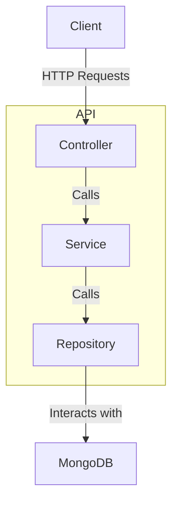

# Express API with TypeScript, MongoDB, and Repository Pattern

## Overview

This project demonstrates a simple API built with Express, TypeScript, and MongoDB using the repository pattern. The API supports creating, retrieving, and paginating orders and products. The architecture follows a clean separation of concerns with repository, service, and controller layers.

## Architecture Diagram




## Setup

### Prerequisites

- Node.js
- npm
- MongoDB

### Installation

1. Clone the repository:

```sh
git clone <repository-url> cd <repository-directory>
```

2. Install dependencies:

```sh
npm install
```

3. Set up environment variables: Create a `.env` file in the root directory and add your MongoDB credentials.

```sh

MONGO_DB_USER=<your-mongodb-user> MONGO_DB_PASSWORD=<your-mongodb-password> MONGO_DB_PATH=<your-mongodb-path>
```

4. Seed the database with initial data (optional):

```sh
npx ts-node src/seeds/seeddb.ts  
```


### Running the Application

1. Start the server:

```sh
npm start watch
```

2. The server will run on `http://localhost:3000`.


## API Endpoints

### Order Routes

#### Create Order

- **URL:** `http://localhost:3000/api/v1/orders`
- **Method:** POST
- **Request Body:**

```json
{
  "products": [number, number, number],
  "orderedBy": "string"
}
```

- **Response:**

```json
{
  "order": {
    "products": [
      {
        "title": "string",
        "price": number,
        "id": number
      }
    ],
    "orderedBy": "string",
    "id": number
  }
}
```
#### Get One Order by ID

- **URL:** `http://localhost:3000/api/v1/orders/:id`
- **Method:** GET
- **Response:**

```json
{
  "result": {
    "products": [
      {
        "title": "string",
        "price": number,
        "id": number
      }
    ],
    "orderedBy": "string",
    "id": number
  }
}
```
#### Get All Orders

- **URL:** `http://localhost:3000/api/v1/orders`
- **Method:** GET
- **Response:**

```json
{
  "result": [
    {
      "products": [
        {
          "title": "string",
          "price": number,
          "id": number
        }
      ],
      "orderedBy": "string",
      "id": number
    },
    {
      "products": [
        {
          "title": "string",
          "price": number,
          "id": number
        }
      ],
      "orderedBy": "string",
      "id": number
    }
  ]
}
```
#### Get Paginated Orders

- **URL:** `http://localhost:3000/api/v1/orders?page=1&limit=2`
- **Method:** GET
- **Response:** Returns the first page with a list of two orders

```json
{
  "result": [
    {
      "products": [
        {
          "title": "string",
          "price": number,
          "id": number
        }
      ],
      "orderedBy": "string",
      "id": number
    },
    {
      "products": [
        {
          "title": "string",
          "price": number,
          "id": number
        }
      ],
      "orderedBy": "string",
      "id": number
    }
  ]
}
```
### Product Routes

#### Create Product

- **URL:** `http://localhost:3000/api/v1/products`
- **Method:** POST
- **Request Body:**

```json
{
  "title": "string",
  "price": number
}
```

- **Response:**

```json
{
  "product": {
    "title": "string",
    "price": number,
    "id": number
  }
}
```
#### Get One Product by ID

- **URL:** `http://localhost:3000/api/v1/products/:id`
- **Method:** GET
- **Response:**

```json
{
  "product": {
    "title": "string",
    "price": number,
    "id": number
  }
}
```
#### Get All Products

- **URL:** `http://localhost:3000/api/v1/products`
- **Method:** GET
- **Response:**

```json
{
  "product": [
    {
      "title": "string",
      "price": number,
      "id": number
    },
    {
      "title": "string",
      "price": number,
      "id": number
    }
  ]
}
```
#### Get Paginated Products

- **URL:** `http://localhost:3000/api/v1/products?page=1&limit=2`
- **Method:** GET
- **Response:** Returns the first page with a list of two products
    
```json
{
  "product": [
    {
      "title": "string",
      "price": number,
      "id": number
    },
    {
      "title": "string",
      "price": number,
      "id": number
    }
  ]
}
```
